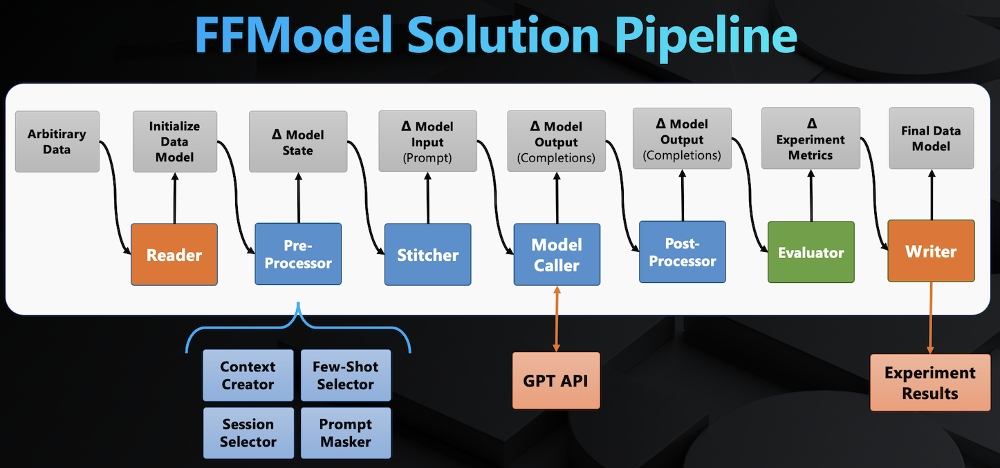

# Building LLM Solutions with FFModel

The Framework for Foundational Models (FFModel) aims to accelerate the development and operationalization of Large Language Models (LLM) based solutions for enterprise scenarios.
FFModel focuses on providing guidance for developing LLM-based solutions, based on our own experiences working with Codex & GPT-3 in the context of our customer engagements.

## Project Structure

This directory is a quick start for creating experimentation repositories that
use FFModel. The following is the recommended structure for the project:

- `components`: This is where you implement your custom experiment components that you want to use in your LLM-based solution using FFModel.
- `docs`: This is where guides and documentation live.
- `examples`: This folder has example experiments for you to upskill on FFModel and get started experimenting with LLMs.
- `experiments`: This is where experiments are defined. It is recommended to create a subdirectory for each experiment.
  This is where solution configuration files will live.
- `utilities`: This is where shared code is stored. This is separate from component
  code in that it can be used by any component.

Although not required, subdirectories are recommended for organizing code.
Make sure each directory has an `__init__.py` file so that they are recognized as
packages by Python.

In addition, there is a **required** `requirements.txt` file at the root of this directory.
This file contains a list of all the external dependencies that are needed to run any of the code in this directory.
If you have no dependencies, leave the file blank.
This file will be used to install your dependencies when you are running experiments or deploying an experiment on your Azure Machine Learning (AML) workspace.

## Getting Started with FFModel

An LLM solution within FFModel is defined as a pipeline of components.
Each component represents a step in your machine learning solution
Within FFModel, components follow a well-defined contract that operates on common data models.
This enables you to reuse components across solutions, change the functionality of the pipeline without any code changes, and be able to plug-n-play components from others as needed, empowering reusability and collaboration.

The following diagram shows the structure of an FFModel solution pipeline, which captures how FFModel solutions operate on common data models via component execution and how data flows through your solution.
The common data model encapsulates the incoming user request and accumulates information as that request flows through your FFModel solution.
The grey boxes capture the deltas to the data model and which type of components consume and/or produce it.
The blue and green boxes represents the different types of components we recommend using in your LLM-solution development.

### Experimentation vs Inference

Using FFModel, the same solution and its components are used to run experiments locally or on the cloud (e.g., using Azure Machine Learning (AML)).
They are also used to deploy a solution for inference.
But, there are key differences between the flow for experimentation (all of the components above) and inference (a subset of components, mostly the blue boxes).
For instance, in experimentation, you will most likely compute evaluation metrics to assess the performance of your experiment.
These metrics are computed within your evaluator components.

Such components are not needed for the inference flow.
FFModel distinguishes between the two different flows using different contracts for the components.
The orchestration logic within FFModel checks the contract for each component. When experimenting, it includes all components, otherwise, for inference, it skips any experimentation-only components (i.e., evaluators, writers).

### Creating your first FFModel solution

Check the following guides to learn more about the different pieces of an FFModel solution:

- Check the [components guide](./docs/guides/solution_components.md) to learn more about the data models and how to implement a custom component.
- Check the [solution config guide](./docs/guides/solution_config.md) to learn more about the solution config and get started experimenting with FFModel.
- Check the [environment configs guide](./docs/guides/environment_configs.md) to learn more about how to integrate your experiment with your environments to run/deploy them.

Please follow the [create your first experiment guide](./docs/guides/creating_solutions.md) to get started.
